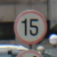
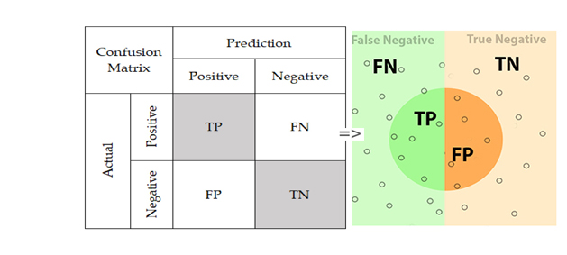
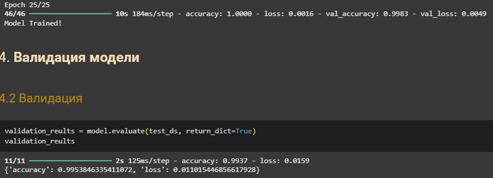
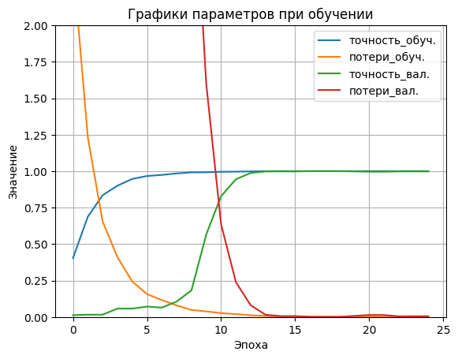
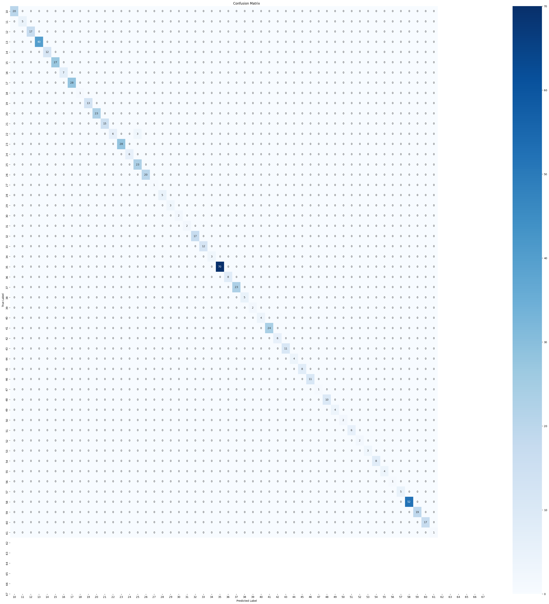

# **Лабораторная работа №4**

## Задание
Целью данной работы является классификация изображений с помощью полносвязной нейронной сети. Для этого был выбран датасет с снимками дорожных знаков. Датасет содержит 58 крассов с разным числом изображений внутри.

Пример из датасета:

И т.д.

## Ход работы

Полносвязная нейронная сеть — это тип искусственной нейронной сети, в котором каждый нейрон одного слоя соединён со всеми нейронами следующего слоя. Это означает, что информация передаётся через сеть без пропусков, и каждый нейрон участвует в формировании выходного сигнала.
Основными параметрами полносвязной НС являются:

- Число слоев определяет глубину нейронной сети. Полносвязная сеть состоит из входного слоя, одного или нескольких скрытых слоев и выходного слоя.
- Число нейронов в слое определяет, насколько сложные зависимости для классфикации сможет определять модель.
- Размер батча (BATCH_SIZE) определяет, сколько примеров данных используется для обновления весов модели за один шаг градиентного спуска.
- Число эпох (EPOCHS) определяет, сколько раз модель будет проходить через весь набор данных во время обучения, главное, чтобы модель не переобучилась.
- Функция активации определяет, как нейроны преобразуют входные данные в выходные. Она добавляет нелинейность в модель, позволяя ей изучать сложные зависимости.
- Оптимизатор определяет, как модель обновляет свои веса на основе ошибки (loss). Он играет ключевую роль в скорости и стабильности обучения. В работе используется Adam - наиболее популярный, адаптирующий скорость обучения для каждого параметра.

Матрица ошибок (Confusion Matrix) — это таблица, которая используется для оценки производительности модели классификации. Она показывает, как модель классифицирует объекты, сравнивая предсказанные метки с истинными метками.

## Результаты классификации

Результаты в цифрах

График обучения

Матрица ошибок (Confusion Matrix)

По результатам классификации на тестовой выборке общая точность составила 99%.

